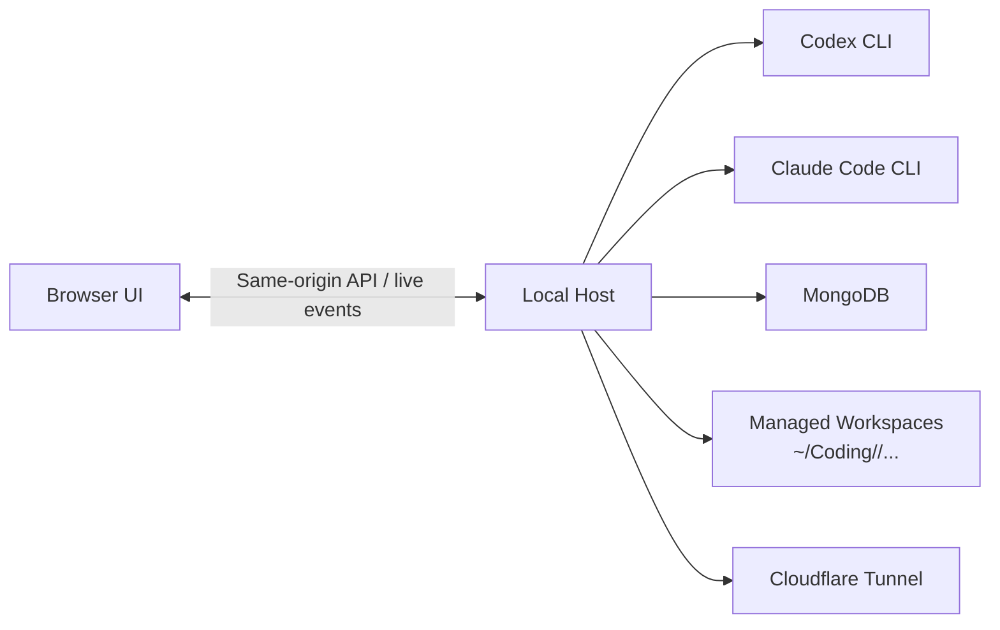
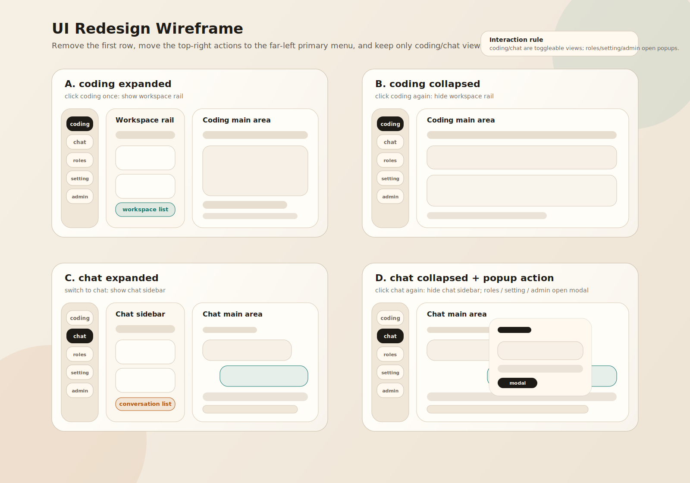

# remote-vibe-coding

[中文说明](./README.md)

> Bring your local AI coding workspace into the browser.
>
> `remote-vibe-coding` is a local-first web shell for `Codex` / `Claude Code`: the real executors run on your own machine, while the browser handles sessions, approvals, attachments, workspaces, and remote access.

## Why It Is More Than Just Another Chat Wrapper

- **Not fake remote**: it talks to real local executors and works directly against your own workspace.
- **Not only a chat box**: Developer mode puts transcripts, command output, file changes, and approval requests into one workspace.
- **Not just for coding**: the same shell supports both `developer` and `chat` modes.
- **Not a naked exposed port**: it supports owner-first login, token fallback, and optional Cloudflare Tunnel access.
- **Not a disposable session**: archive, restore, fork, restart, stop, attachments, and durable history are built in.

## Understand It In One Diagram



## UI Sketch

> This image comes from the early layout sketch already in the repo. It shows the basic UI center of gravity: sessions on the left, transcript in the middle, approvals and context on the right.



## UI Preview

> Put future screenshots under `docs/screenshots/`.  
> When you add one, replace the matching placeholder block with ``.

### 1. Login And Main Workspace

> Screenshot placeholder: `docs/screenshots/01-login-overview.png`
>
> Suggested frame: the login page, or the post-login home screen. Ideally show the session rail, the transcript center pane, and the approval / info panel together.

### 2. Developer Mode

> Screenshot placeholder: `docs/screenshots/02-developer-session.png`
>
> Suggested frame: a coding session after creating a workspace, including the prompt composer, running state, file change cards, and approval state.

### 3. Chat Mode And Attachment Context

> Screenshot placeholder: `docs/screenshots/03-chat-attachments.png`
>
> Suggested frame: a chat conversation with image / PDF / text attachments, inline preview, and role preset selection.

### 4. Workspace File Browser

> Screenshot placeholder: `docs/screenshots/04-workspace-browser.png`
>
> Suggested frame: the file tree, file preview, and how a session maps to its workspace.

### 5. Admin / Users And Roles

> Screenshot placeholder: `docs/screenshots/05-admin-roles-presets.png`
>
> Suggested frame: user management, role assignment, default mode, and chat role preset management.

### 6. Cloudflare Remote Access

> Screenshot placeholder: `docs/screenshots/06-cloudflare-status.png`
>
> Suggested frame: tunnel status, connect / disconnect actions, and the stable public URL display.

## Who It Is For

- People who want to continue AI-assisted coding from the browser without moving their code into a stranger's cloud.
- People who want transcript, approvals, attachments, and workspace management in one interface.
- People who want `Codex` as the default executor, but still want the option to switch to `Claude Code` when it is available locally.
- People who need a remote-accessible, owner-first workspace without giving up local control.

## Core Capabilities

### Developer Mode

- Create a managed workspace, or clone a Git repository directly into one.
- Start coding sessions bound to a single primary workspace.
- Review prompts, tool calls, command output, and file changes directly in the transcript.
- Handle approval-required actions explicitly instead of silently auto-approving them.
- Archive, restore, fork, rename, stop, and restart sessions.
- Switch model, reasoning effort, approval mode, and available executor.

### Chat Mode

- Run assistant-style conversations inside a shared `chat` workspace.
- Upload images, PDFs, and text-like files as context.
- Auto-generate titles after the first message and keep durable history.
- Use admin-managed role presets for repeatable prompt setups.
- Share the same login, storage, and browser shell as Developer mode.

### Runtime And Management

- The host runs locally; the frontend is React + Vite and the backend is Fastify.
- `Codex` is the default executor; `Claude Code` can also be enabled when installed locally.
- The browser entrypoint is login-gated by default.
- Cloudflare Tunnel can be connected and disconnected directly from the UI.
- Attachments are written into managed workspaces so the executor can read and modify them in place.

## A Typical Flow

1. Sign in to the local host.
2. Create a workspace, or clone a Git repository into one.
3. Create a `developer` or `chat` session.
4. Send a prompt and attach images, PDFs, or text files when needed.
5. Handle sensitive actions such as cross-boundary access or network requests from the approval panel.
6. Expose the browser entrypoint through Cloudflare Tunnel when you need remote access.
7. Archive the session when you are done, or fork it when you want to continue on a branch.

## Quick Start

### Prerequisites

The machine running the host needs:

- `Node.js` and `npm`
- `MongoDB`
- `codex` CLI
- optional: `claude` CLI, if you want to enable `Claude Code`
- optional: `cloudflared`, if you want built-in tunnel support

If `codex` or `claude` is not on the default path, set `CODEX_BIN` / `CLAUDE_BIN`.

### 1. Install Dependencies

```bash
npm install
```

### 2. Start MongoDB

One simple local option:

```bash
docker run --name rvc-mongo -p 27017:27017 -d mongo:7
```

### 3. Set The First Login

```bash
export RVC_AUTH_USERNAME=owner
export RVC_AUTH_PASSWORD='change-me'
```

### 4. Recommended: Use The Dev Startup Script

For `Codex` only:

```bash
bash scripts/rvc-dev.sh start all --executor codex
```

If the machine has both `Codex` and `Claude Code` installed:

```bash
bash scripts/rvc-dev.sh start all --executor both
```

Useful follow-up commands:

```bash
bash scripts/rvc-dev.sh status all
bash scripts/rvc-dev.sh restart all
```

Default dev ports:

- Host: `http://127.0.0.1:8788`
- Web: `http://127.0.0.1:5174`

### 5. Open The Browser

Visit:

```text
http://127.0.0.1:5174
```

## Manual Startup

If you prefer to run the raw commands instead of the helper script:

```bash
npm run dev:host
```

```bash
npm run dev:web
```

Default ports:

- Host: `http://127.0.0.1:8787`
- Web: `http://127.0.0.1:5173`

If the host is on a non-default port:

```bash
npm run dev:web -- --api-port 8788
```

## Production

### Single-Origin Run

```bash
npm run build
npm run start:host
```

Then open `http://127.0.0.1:8787`.

### macOS LaunchAgent Setup

If you want to run it as a resident local service, the repo includes LaunchAgent helpers:

```bash
bash scripts/rvc-prod-launchagent.sh install all --executor codex
```

Useful follow-up commands:

```bash
bash scripts/rvc-prod-launchagent.sh status all
bash scripts/rvc-prod-launchagent.sh restart all
```

> These production scripts depend on macOS `LaunchAgent`. If you are not on macOS, prefer the single-origin run above.

## Auth

- Unauthenticated browser requests redirect to `/login`.
- Password login sets an HTTP-only cookie.
- `?token=...` links still work as a fallback.
- Users, roles, preferred mode, and tokens are managed by the host.

If you do not set `RVC_AUTH_USERNAME` / `RVC_AUTH_PASSWORD` before the first boot, the app creates an `owner` user automatically and writes auth state to:

- `~/.config/remote-vibe-coding/auth.json`

That file stores the password hash and token, not the plaintext password.  
For local-only debugging, you can also set:

```bash
export RVC_DEV_DISABLE_AUTH=1
```

## Data Storage

| Location | Purpose |
| --- | --- |
| `~/.config/remote-vibe-coding/auth.json` | Auth state and user records |
| `~/.config/remote-vibe-coding/sessions.json` | Locally persisted session state and backups |
| `~/Coding/<username>/...` | Managed workspace root |
| MongoDB `remote_vibe_coding` | Chat history, coding sessions, and workspace records |

Current attachment behavior:

- max single-file size: `20 MB`
- supported kinds: image, PDF, generic file
- PDFs and text-like files are text-extracted when possible

## Key Configuration

| Variable | Purpose | Default |
| --- | --- | --- |
| `HOST` | Host bind address | `127.0.0.1` |
| `PORT` | Host port | `8787` |
| `MONGODB_URL` | MongoDB connection string | `mongodb://127.0.0.1:27017/?directConnection=true` |
| `MONGODB_DB_NAME` | MongoDB database name | `remote_vibe_coding` |
| `CODEX_BIN` | Path to the Codex executable | platform default |
| `CLAUDE_BIN` | Path to the Claude Code executable | platform default |
| `RVC_EXECUTOR_INIT` | Initial executor mode: `auto` / `codex` / `claude-code` / `both` | `auto` |
| `RVC_AUTH_USERNAME` | Username for the first admin user | none |
| `RVC_AUTH_PASSWORD` | Password for the first admin user | none |
| `RVC_AUTH_TOKEN` | Fixed token for the first admin user | none |
| `RVC_DEV_DISABLE_AUTH` | Skip browser auth in local dev | `0` |
| `CLOUDFLARE_TUNNEL_TOKEN` | Use a managed tunnel | none |
| `CLOUDFLARE_PUBLIC_URL` | Stable public URL shown in the UI | none |
| `CLOUDFLARE_TARGET_URL` | Override the local target exposed by the tunnel | none |
| `VITE_API_BASE_URL` | API base URL when the web app runs separately from the host | none |

## Cloudflare Support

The current Cloudflare integration supports:

- `cloudflared` quick tunnels
- named tunnels already defined in `~/.cloudflared/config.yml`
- managed tunnels via `CLOUDFLARE_TUNNEL_TOKEN`
- connect / disconnect actions directly from the browser UI

When built frontend assets exist, the host serves the web app and API from the same origin. If not, the tunnel logic can fall back to the local Vite dev server.

## Repo Layout

- `apps/host`: the local host, responsible for auth, session state, approvals, tunnel orchestration, persistence, and executor bridging.
- `apps/web`: the browser client for both Developer and Chat experiences.
- `scripts/`: development and production startup scripts.
- `docs/phase-1-architecture.md`: current product and technical blueprint.
- `docs/ui-redesign-left-nav-wireframe.svg`: the UI sketch referenced in this README.

## Current Scope

This repo is already usable, but it is still an intentionally constrained phase-1 product:

- The current center of gravity is desktop web, not mobile.
- Remote access depends on tunnels; Cloudflare Access is not integrated yet.
- A workspace is the primary context boundary, not a hard isolation sandbox.
- The Flutter client is not part of the mainline runtime.
- True multi-executor abstraction is still evolving; today the default experience is `Codex`, with `Claude Code` as an optional extension.

## Further Reading

- [Phase 1 Architecture](./docs/phase-1-architecture.md)
- [Queued Follow-Up Turns Design](./docs/queued-follow-up-turns.md)
