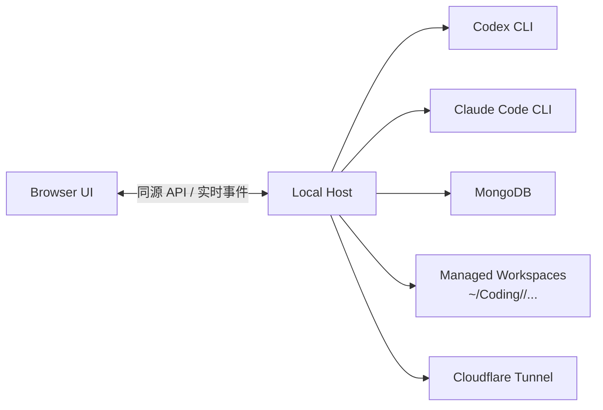
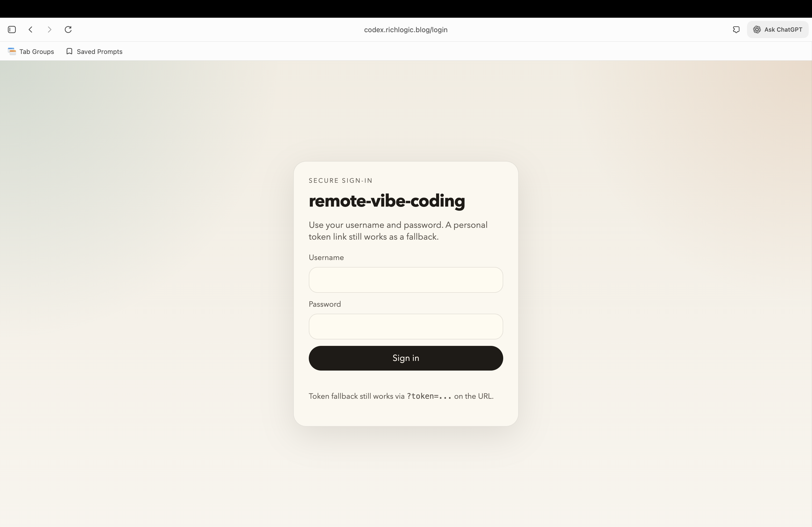
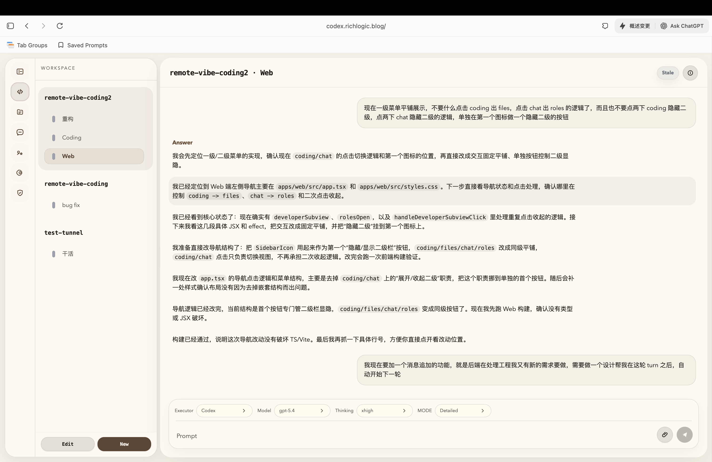
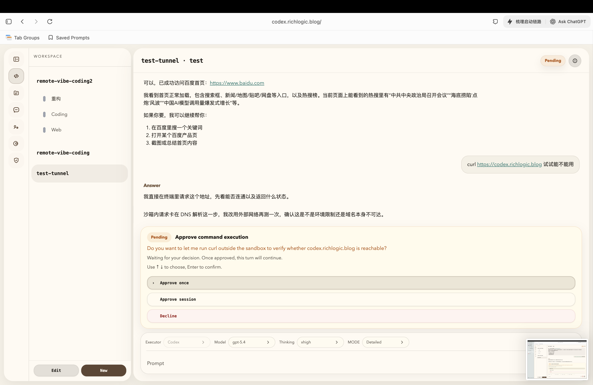
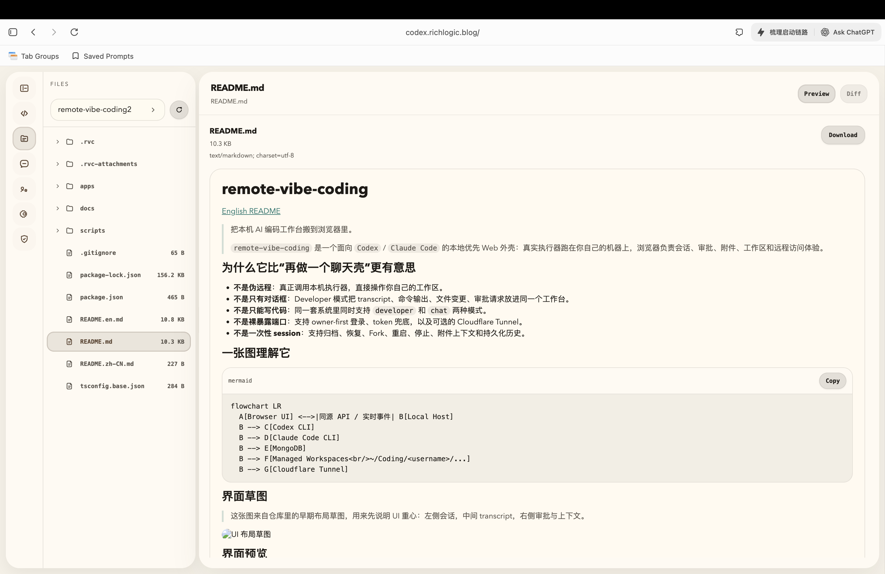
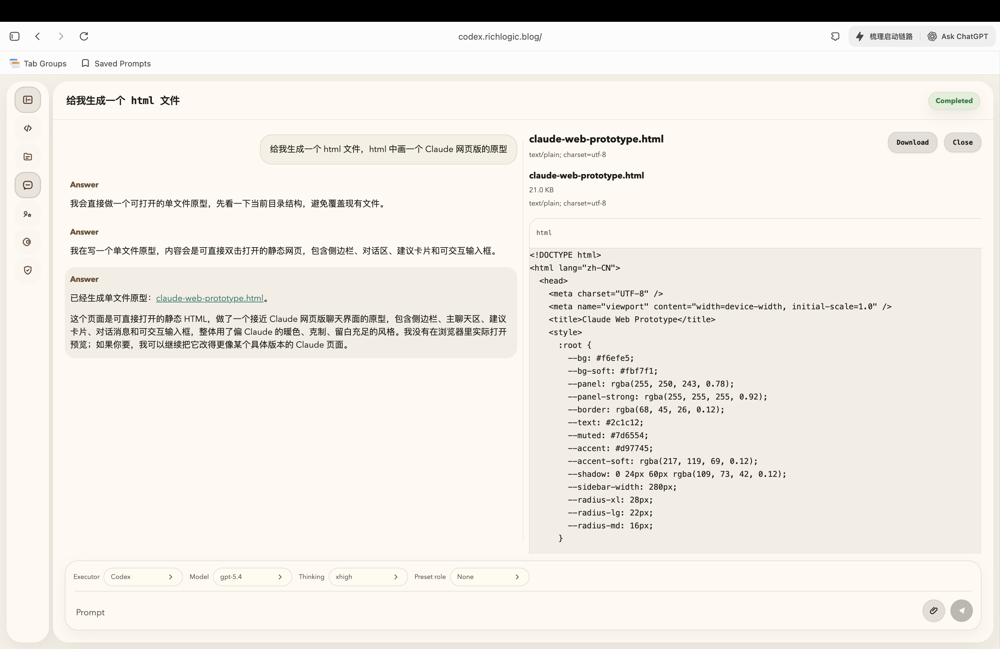

# remote-vibe-coding

[English README](./README.en.md)

> 把本机 AI 编码工作台搬到浏览器里。
>
> `remote-vibe-coding` 是一个面向 `Codex` / `Claude Code` 的本地优先 Web 外壳：真实执行器跑在你自己的机器上，浏览器负责会话、审批、附件、工作区和远程访问体验。

## 为什么它比“再做一个聊天壳”更有意思

- **不是伪远程**：真正调用本机执行器，直接操作你自己的工作区。
- **不是只有对话框**：Developer 模式把 transcript、命令输出、文件变更、审批请求放进同一个工作台。
- **不是只能写代码**：同一套系统里同时支持 `developer` 和 `chat` 两种模式。
- **不是裸暴露端口**：支持 owner-first 登录、token 兜底，以及可选的 Cloudflare Tunnel。
- **不是一次性 session**：支持归档、恢复、Fork、重启、停止、附件上下文和持久化历史。

## 一张图理解它



## 界面草图

> 这张图来自仓库里的早期布局草图，用来先说明 UI 重心：左侧会话，中间 transcript，右侧审批与上下文。


## 界面预览

> 当前截图统一放在 `docs/screenshots/`，下面这组预览覆盖登录、Developer、Chat、文件浏览和管理员配置。

### 1. 登录与主工作台



登录后可以直接进入主工作台：左侧是模式和会话栏，中间是 transcript，右侧承接会话详情、审批和上下文。

### 2. Developer 模式



Developer 模式把编码会话放进完整工作台里，便于同时查看 prompt、运行状态、文件改动和审批流。

### 3. Chat 模式与附件上下文



Chat 模式支持图片、PDF 和文本附件，附件会进入共享 chat workspace，并可在界面里直接预览上下文。

### 4. Workspace 文件浏览



文件浏览视图把 workspace 文件树、文件预览和当前会话上下文并排放在一起，便于快速核对改动落点。

### 5. Admin / 用户与角色管理



管理员可以在同一个界面里维护用户、角色、默认模式，以及 Chat 角色预设。

### 6. 公网访问 / Cloudflare Tunnel

这部分不再依赖单独截图，因为公网域名本身就是更直接的证明。

当前这套部署已经可以通过 Cloudflare Tunnel 从公网访问，例如：

- `https://codex.richlogic.blog`

相比“状态页截图”，真实可访问的域名更能说明这套远程访问链路已经跑通：浏览器入口、登录流程和 Host 服务都已经可以从外网正面访问。

## 适合谁

- 想在浏览器里继续自己电脑上的 AI 编码流程，而不是把代码丢进陌生云环境的人。
- 需要把 transcript、审批、附件、工作区管理放进同一个界面的人。
- 想把 `Codex` 作为默认执行器，但又希望在本机可用时切到 `Claude Code` 的人。
- 需要一个 owner-first、可远程访问、但仍保持本地控制权的工作台的人。

## 核心能力

### Developer 模式

- 创建托管 workspace，或从 Git 仓库直接克隆到托管 workspace。
- 启动绑定单一主 workspace 的编码会话。
- 在 transcript 里查看 prompt、工具调用、命令输出和文件变更。
- 对需要用户决定的操作做显式审批，而不是静默自动放行。
- 支持归档、恢复、Fork、重命名、停止、重启会话。
- 支持切换模型、推理强度、审批模式，以及可用执行器。

### Chat 模式

- 在共享 `chat` workspace 中跑更偏助手型的对话流程。
- 上传图片、PDF 和文本类文件作为上下文。
- 首条消息后自动生成标题，历史会话可持续保存。
- 支持管理员维护的角色预设，适合固定 prompt 场景。
- Chat 和 Developer 共用同一套登录、存储和浏览器外壳。

### 运行与管理

- Host 运行在本机，前端是 React + Vite，后端是 Fastify。
- 默认执行器是 `Codex`；如果本机安装了 `Claude Code`，也可以按配置启用。
- 浏览器入口默认需要登录，未认证用户不会直接落到工作台。
- Cloudflare Tunnel 可以直接从 UI 触发连接和断开。
- 附件写入托管 workspace，方便执行器原地读取和修改。

## 一次典型流程

1. 登录本地 Host。
2. 新建一个 workspace，或者直接克隆 Git 仓库。
3. 选择 `developer` 或 `chat` 模式创建会话。
4. 发出 prompt，必要时附上图片、PDF 或文本文件。
5. 在右侧审批区处理越权操作、网络访问或其他敏感动作。
6. 需要远程继续时，通过 Cloudflare Tunnel 暴露浏览器入口。
7. 会话结束后归档；需要延续分支时直接 Fork。

## 快速开始

### 依赖准备

运行 Host 的机器需要：

- `Node.js` 和 `npm`
- `MongoDB`
- `codex` CLI
- 可选：`claude` CLI（如果你想启用 `Claude Code`）
- 可选：`cloudflared`（如果你想启用内置 Tunnel）

如果 `codex` 或 `claude` 不在默认路径上，请分别设置 `CODEX_BIN` / `CLAUDE_BIN`。

### 1. 安装依赖

```bash
npm install
```

### 2. 启动 MongoDB

最简单的本地方式之一：

```bash
docker run --name rvc-mongo -p 27017:27017 -d mongo:7
```

### 3. 设置首次登录账号

```bash
export RVC_AUTH_USERNAME=owner
export RVC_AUTH_PASSWORD='change-me'
```

### 4. 推荐方式：直接启动开发脚本

只启用 `Codex`：

```bash
bash scripts/rvc-dev.sh start all --executor codex
```

如果本机同时装了 `Codex` 和 `Claude Code`，也可以：

```bash
bash scripts/rvc-dev.sh start all --executor both
```

常用命令：

```bash
bash scripts/rvc-dev.sh status all
bash scripts/rvc-dev.sh restart all
```

默认开发端口：

- Host: `http://127.0.0.1:8788`
- Web: `http://127.0.0.1:5174`

### 5. 打开浏览器

访问：

```text
http://127.0.0.1:5174
```

## 另一种启动方式

如果你更喜欢直接跑原始命令，而不是使用脚本：

```bash
npm run dev:host
```

```bash
npm run dev:web
```

默认端口：

- Host: `http://127.0.0.1:8787`
- Web: `http://127.0.0.1:5173`

如果 Host 不在默认端口，可以这样启动前端：

```bash
npm run dev:web -- --api-port 8788
```

## 生产运行

### 单域名运行

```bash
npm run build
npm run start:host
```

然后访问 `http://127.0.0.1:8787`。

### macOS LaunchAgent 方式

如果你想把它当作常驻本机服务运行，仓库自带了 LaunchAgent 脚本：

```bash
bash scripts/rvc-prod-launchagent.sh install all --executor codex
```

常用命令：

```bash
bash scripts/rvc-prod-launchagent.sh status all
bash scripts/rvc-prod-launchagent.sh restart all
```

> 这套生产脚本依赖 macOS `LaunchAgent`。如果你不在 macOS 上，优先用上面的单域名运行方式。

## 登录与认证

- 浏览器入口默认会重定向到 `/login`。
- 登录成功后会写入 HTTP-only cookie。
- `?token=...` 链接仍然可以作为兜底方案。
- 用户、角色、默认模式和 token 都由 Host 管理。

如果你第一次启动时没有设置 `RVC_AUTH_USERNAME` / `RVC_AUTH_PASSWORD`，应用会自动创建 `owner` 用户，并把认证状态写入：

- `~/.config/remote-vibe-coding/auth.json`

文件里保存的是密码哈希和 token，不是明文密码。  
如果只是本地调试，也可以在启动 Host 前设置：

```bash
export RVC_DEV_DISABLE_AUTH=1
```

## 数据存储

| 位置 | 说明 |
| --- | --- |
| `~/.config/remote-vibe-coding/auth.json` | 认证状态和用户记录 |
| `~/.config/remote-vibe-coding/sessions.json` | 本地持久化的会话状态和备份 |
| `~/Coding/<username>/...` | 托管 workspace 根目录 |
| MongoDB `remote_vibe_coding` | 聊天历史、编码会话、workspace 记录 |

当前附件行为：

- 单文件最大 `20 MB`
- 支持图片、PDF 和通用文件
- PDF 和文本类文件会尽可能做文本提取

## 关键配置

| 变量 | 作用 | 默认值 |
| --- | --- | --- |
| `HOST` | Host 绑定地址 | `127.0.0.1` |
| `PORT` | Host 端口 | `8787` |
| `MONGODB_URL` | MongoDB 连接串 | `mongodb://127.0.0.1:27017/?directConnection=true` |
| `MONGODB_DB_NAME` | MongoDB 数据库名 | `remote_vibe_coding` |
| `CODEX_BIN` | Codex 可执行文件路径 | 平台默认 |
| `CLAUDE_BIN` | Claude Code 可执行文件路径 | 平台默认 |
| `RVC_EXECUTOR_INIT` | 初始化执行器：`auto` / `codex` / `claude-code` / `both` | `auto` |
| `RVC_AUTH_USERNAME` | 首个管理员用户名 | 无 |
| `RVC_AUTH_PASSWORD` | 首个管理员密码 | 无 |
| `RVC_AUTH_TOKEN` | 首个管理员固定 token | 无 |
| `RVC_DEV_DISABLE_AUTH` | 开发环境跳过浏览器认证 | `0` |
| `CLOUDFLARE_TUNNEL_TOKEN` | 使用 managed tunnel | 无 |
| `CLOUDFLARE_PUBLIC_URL` | UI 展示的稳定公网地址 | 无 |
| `CLOUDFLARE_TARGET_URL` | Tunnel 暴露的本地目标地址 | 无 |
| `VITE_API_BASE_URL` | 前端脱离 Host 单独运行时的 API 基地址 | 无 |

## Cloudflare 支持

当前 Cloudflare 集成支持：

- `cloudflared` quick tunnel
- `~/.cloudflared/config.yml` 中已有的 named tunnel
- 通过 `CLOUDFLARE_TUNNEL_TOKEN` 使用 managed tunnel
- 在浏览器 UI 里直接执行 connect / disconnect

如果已经存在前端构建产物，Host 会以同源方式提供前端和 API；如果没有，Tunnel 也可以回退到本地 Vite 开发服务器。

## 仓库结构

- `apps/host`：本地 Host，负责认证、会话状态、审批、Tunnel、持久化，以及对执行器的桥接。
- `apps/web`：浏览器客户端，承载 Developer / Chat 两类体验。
- `scripts/`：开发与生产启动脚本。
- `docs/phase-1-architecture.md`：当前阶段的产品和技术蓝图。
- `docs/ui-redesign-left-nav-wireframe.svg`：README 中引用的界面草图。

## 当前边界

这个仓库已经可用，但它仍然是一个刻意收敛范围的 phase-1 产品：

- 当前重心是桌面 Web，不是移动端。
- 远程访问依赖 Tunnel，暂未集成 Cloudflare Access。
- workspace 是主上下文边界，不是完全硬隔离沙箱。
- Flutter 客户端不在当前主线运行时范围内。
- 真正的多执行器抽象还在演进中；目前以 `Codex` 为默认体验，`Claude Code` 为可选扩展。

## 进一步阅读

- [Phase 1 架构说明](./docs/phase-1-architecture.md)
- [排队后续 turn 设计](./docs/queued-follow-up-turns.md)
